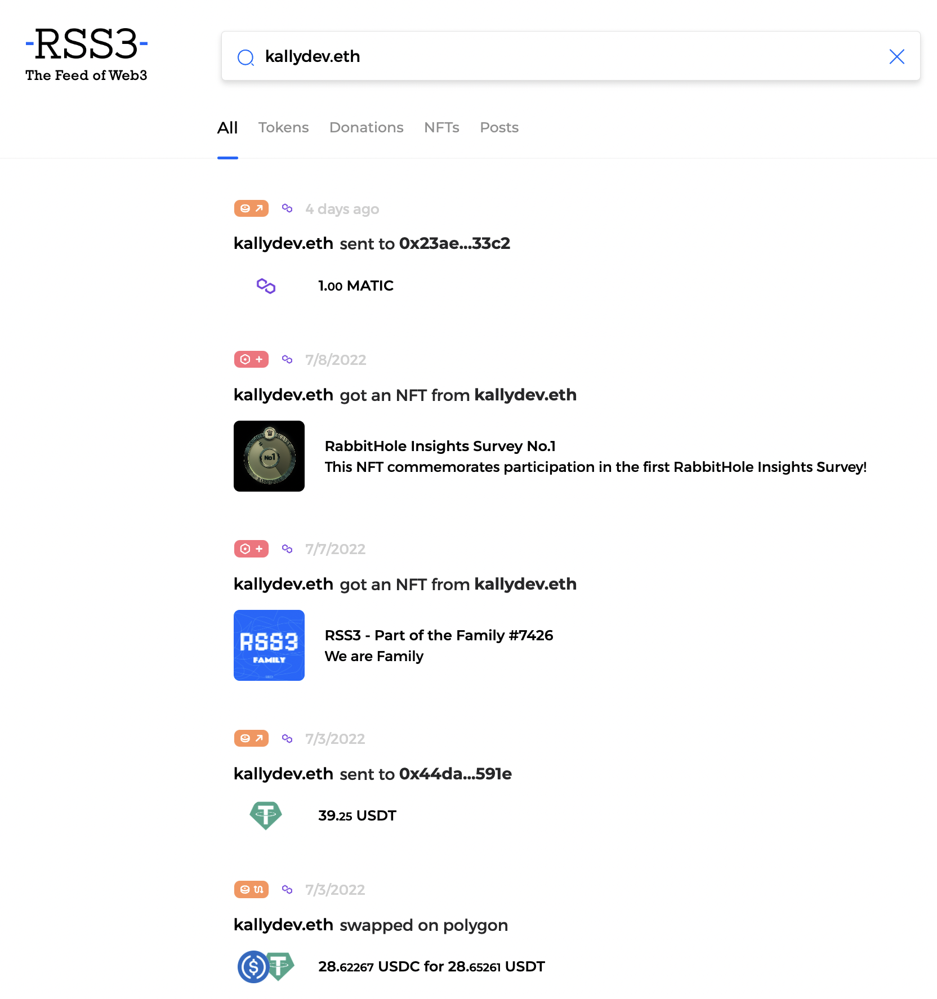
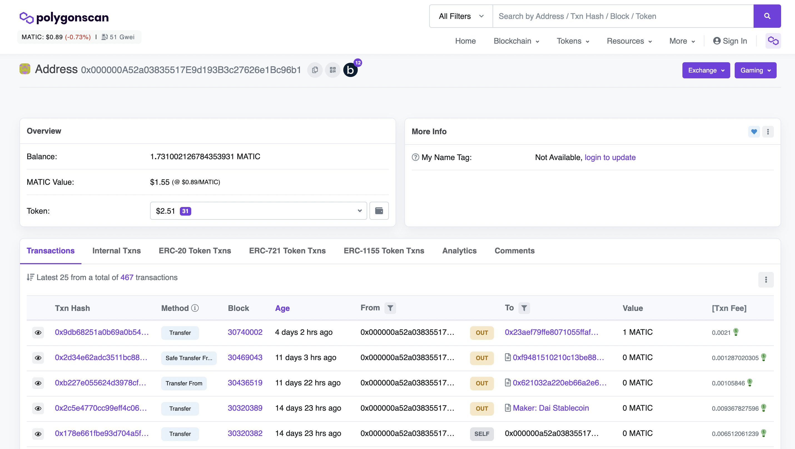

Dear Web3 Users:

Greetings from RSS3!

Since the initial launch of [rss3.io](https://rss3.io), we have received a lot of feedback (both positive and negative), thank you!

We know that tracking activities such as transactions, NFTs, posts, and donations on different decentralized platforms can be an overwhelming task, and various scans certainly do not make it easier. These Web3 activities essentially form a Web3 Feed, and [rss3.io](https://rss3.io)'s goal is to provide an easy way for reading.

**But that's not enough.**

Today we are introducing a brand new version of [rss3.io](https://rss3.io), which further amplifies the experience of exploring Web3 Feeds. Compared to scans, [rss3.io](https://rss3.io) is much more intuitive and aesthetically pleasing.

This new version includes many new features as well as under-the-hood improvements, here we list some major ones:

**Features**:

1. A `Watch` feature that allows anyone to stay on top of the activities performed by any address.
1. A `Reader` feature that enables a seamless reading experience for all addresses Watched.
    1. If you are still not satisfied (do get in touch with us [xxx@rss3.io](mailto:xxx@rss3.io)), [rss3.io](https://rss3.io) allows you to generate an RSS feed to be consumed by any app of your choice.
1. A `Manage` page for user setting management. We believe that **privacy should always come first**, that's why we do not record any personally identifiable information. Plus on the Manage page, you can opt out of any features that may require anonymized data collection.

The use of these features **does not require** a wallet connection, and all actions performed **do not interact with a blockchain**.

**Improvements**:

1. A major user interface (UI) upgrade to please your eyes.
1. A major user experience (UX) upgrade to smooth the interactions.
1. We have also greatly improved the experience on smartphones and tablets.

We also have some exciting features sitting in our backlog, so stay tuned!

Cheers,

Dev 🌀 RSS3
