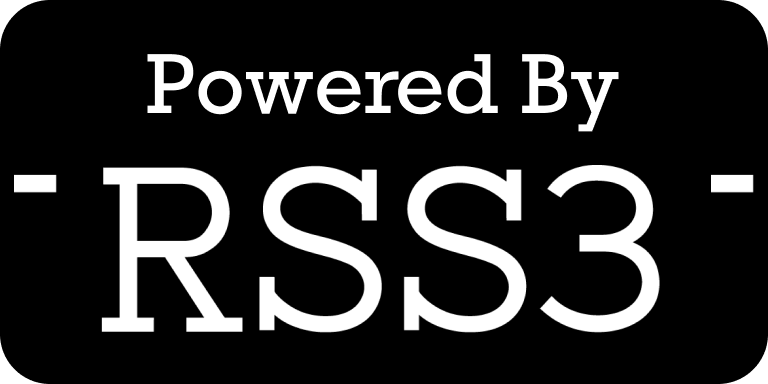

import styles from './introduction.module.css';

# Introduction

PreGod provides a set of simple-to-use APIs to access the feed of Web3. Currently, the stable version is v1.0.0. The source code is [available on GitHub](https://github.com/NaturalSelectionLabs/PreGod).

The release of PreGod v1.0.0 also means that previous versions will have a change of state, see [versions](/versions).

## API endpoint

Current stable endpoint: <https://pregod.rss3.dev/v1.0.0>

> While the use of all RSS3 APIs is completely free, we kindly request that you include our logo with a link back to either our home page or the specific content URL on our website. For more information, please refer to our [branding guidelines](/misc/branding).

:::info
To ensure the usability, we may introduce rate limiting in the future.
:::

## Data Sources Supported

### List of Networks

| Network                   | Tag    |
| ------------------------- | ------ |
| Ethereum                  | All    |
| Ethereum Classic          | All    |
| BSC (Binance Smart Chain) | All    |
| Polygon                   | All    |
| zkSync                    | All    |
| xDai                      | All    |
| Arweave                   | Social |
| Crossbell                 | All    |

### List of Platforms

| Platform  | Network                              | Tag                 |
| --------- | ------------------------------------ | ------------------- |
| Crossbell | Crossbell                            | Collectible, Social |
| Mirror    | Arweave                              | Social              |
| Lens      | Polygon                              | Social              |
| POAP      | Ethereum                             | Collectible         |
| Gitcoin   | Ethereum, Polygon, zkSync            | Donation            |
| Snapshot  | All (except Arweave)                 | Governance          |
| DEX, CEX  | Ethereum, Polygon, BSC, zkSync, xDai | Exchange            |

### List of Tags and corresponding Types

| Tag         | Type                                                  |
| ----------- | ----------------------------------------------------- |
| Transaction | transfer, mint, burn, cancel                          |
| Exchange    | withdraw, deposit, swap                               |
| Collectible | trade, mint, burn , POAP                              |
| Social      | post, comment, share, profile, follow, unfollow, link |
| Donation    | launch, donate                                        |
| Governance  | propose, vote                                         |
