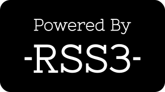

# Introduction

PreGod provides a set of simple-to-use APIs to access the feed of Web3. Currently, the stable version is v1.0.0. The source code will be made [available on GitHub](https://github.com/NaturalSelectionLabs/PreGod) soon.

The release of PreGod v1.0.0 also means that previous versions will have a change of state, see [versions](/versions).

## API endpoint

Current stable endpoint: <https://pregod.rss3.dev/v1.0.0>

> While the use of all RSS3 APIs is completely free, we kindly request that you include our logo with a link back to either our home page or the specific content URL on our website. For more information, please refer to our [branding guidelines](/misc/branding).

:::info
To ensure usability for everyone, we limit request to 600 per minute. The limit will gradually increase as we see fit.
:::
