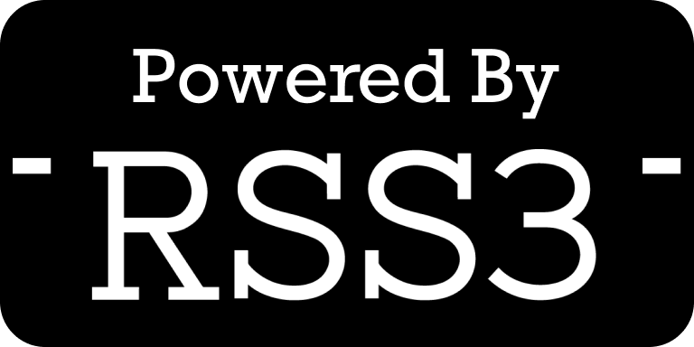

import styles from "./introduction.module.css";

# Introduction

RSS3 PreGod marks a milestone towards our ultimate goal, a fully decentralized service that provides the Web3 feed of any instance.

As an implementation of the RSS3 Protocol, PreGod provides a set of simple-to-use APIs to access the feed of Web3. Currently, the stable version is . The source code is [available on GitHub](https://github.com/NaturalSelectionLabs/RSS3-PreGod).

The release of PreGod v0.4.0 also means that PreNode v0.3.1 will be switched to a maintenance-only state, aiming to support the existing applications that rely on it.

## API endpoint

Current stable endpoint: <https://pregod.rss3.dev/v0.4.0>

> While the use of all RSS3 APIs is completely free, we kindly request that you include our logo with a link back to either our home page or the specific content URL on our website. For more information, please refer to our [branding guidelines](/docs/misc/branding).

:::info
To ensure the usability, we may introduce rate limiting in the future.
:::

## Data Sources Supported

- Ethereum
- Polygon
- BNB Smart Chain
- zkSync
- Mirror Entry
- Gitcoin Contribution
- Crossbell
